# Odoo-on-IKS

##  Odoo Business Apps on IBM Cloud.

	 	 	 		

This document will help penetrating a new market IBM didn’t use to knock. Which is the small business market, Egypt will be the example we will use most of the time, which we believe we can clone it to similar countries. 
The document will 
Give an overview about Odoo,  Its customer segment, It’s market share..etc.
Financial Figure for an average setup of Odoo on IBM Cloud.	
Architecture Diagram for Odoo on IBM Cloud.
How to integrate Odoo with IBM Services. 
Detailed Technical guide describing the “How To”.

## Odoo Overview
Odoo is a suite of web-based open source business apps. The main Odoo Apps include an Open Source CRM, Website Builder, eCommerce, Project Management, Billing & Accounting, Point of Sale, Human Resources, Marketing, Manufacturing, Purchase Management, …
			
Odoo Apps can be used as stand-alone applications, but they also integrate seamlessly so you get a full-featured Open Source ERP when you install several Apps.	

Odoo Partners in Egypt			
Odoo has a long list of Partners, When it comes to Egypt, we can list around 25 Partners, 9 of them are Golden Partners, 6 of them are Silver. The total number of end customers for those partners are exceeding 1K.

## Why IBM 
Odoo is a web based suite of business apps. Odoo Apps can be used as stand-alone applications, but they also integrate seamlessly so you get a full-featured Open Source ERP when you install several Apps.

Odoo also is available as a Containerized Helm Chart through Bitnami and IBM Helm Catalog on the Public Cloud Platform.

Helm Charts needs Kubernetes to run on top of it, IBM will not just offer a Hosting environment for Odoo, The story is much longer.

IBM is offering the Kubernetes and Openshift
IBM is offering Odoo as a Helm Chart
Kubernetes Cluster Integrates with third party services to give a more solid solution powered by Logging and Monitoring through  LogDNA and SysDig.
IBM has a Catalog of CP Services which can enrich the solution above and beyond.

##  Technical Architecture 
IBM Cloud VPC is the Infrastructure backbone which hosts IKS (IBM Kubernetes Service). We picked IKS on top of Openshift to keep the solution simple and cheaper. 

IBM Cloud™ Virtual Private Cloud (VPC) is your own protected space in the IBM Cloud. IBM Cloud VPC provides the advanced security of private cloud with the agility and ease of public cloud.

IBM Cloud™ Kubernetes (IKS) Service is the core of the solution and its main tasks are to automate, isolate, secure, manage, and monitor your workloads across zones or regions.

 IBM Cloud Kubernetes Service partners with other third-party service providers to enhance your cluster with top-notch logging, monitoring, and storage tools.
 
LogDNA is a third-party service that you can use to add intelligent logging capabilities to your cluster and apps.

Sysdig is a third-party, cloud-native container analytics system that you can use to gain insight into the performance and health of your compute hosts, apps, containers, and networks.

Odoo is available at IBM Cloud Helm Charts, This document will use version 13.0.5. 

  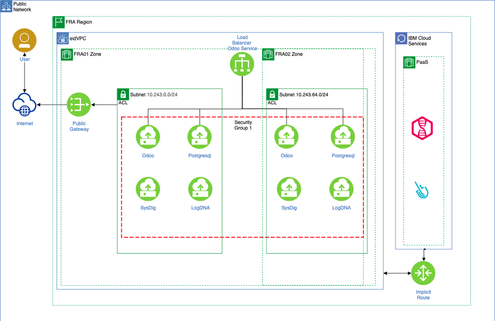

Installation Guide - Detailed Technical Guide 

Prerequisite :  VPC 
#### Step 01
You will need to create a VPC in the region we decided to host our cluster. (Frankfurt)
From IBM Cloud portal , choose to create a VPC. Give it a name and accept all the default, attached a public gateway.

#### Step 02
We will need to create a Subnet in each DC we will need to spread our workers in, So 
One SN in FRA01, and another one in FRA02. Like below.

  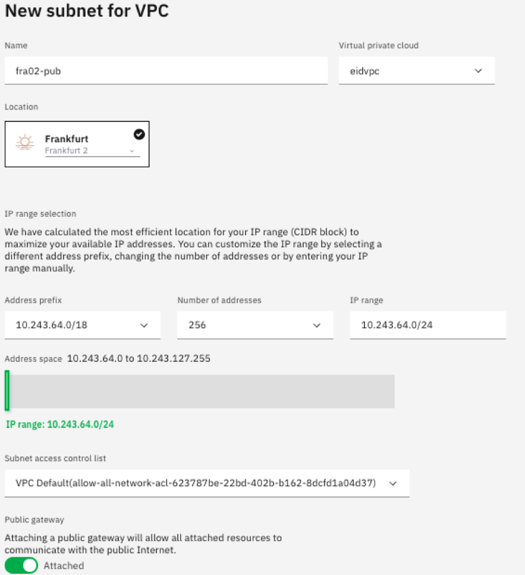

#### Provisioning the Cluster
While provisioning IKS, you can pick IKS instead of Openshift.
IKS is simpler and cheaper than Openshift which solidify our target of having a simple and cheap solution.

#### Step 01
We will go with the standard cluster and IKS on top of a VPC Infrastructure. 
VPC and the subnets you’ve created in the previous step will be fetched in this step automatically. 
I will build the cluster on only Multiple Zone, I will limit it only on two. (Check Below) 

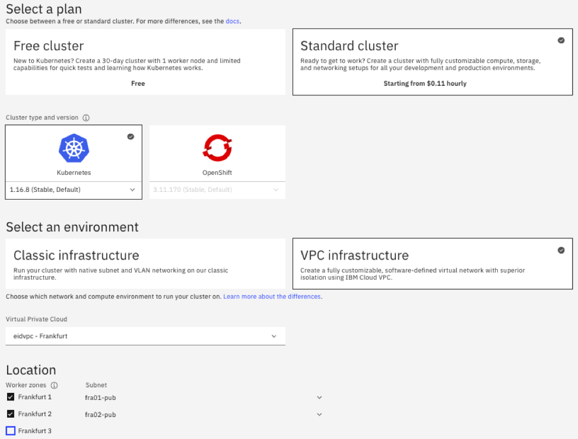

Give a name to the Cluster, May be Tags as well.
Choose the proper Worker Size , I’ve limited it to medium VMs.
I’ve limited the worker nodes to only two. (Check Below) 

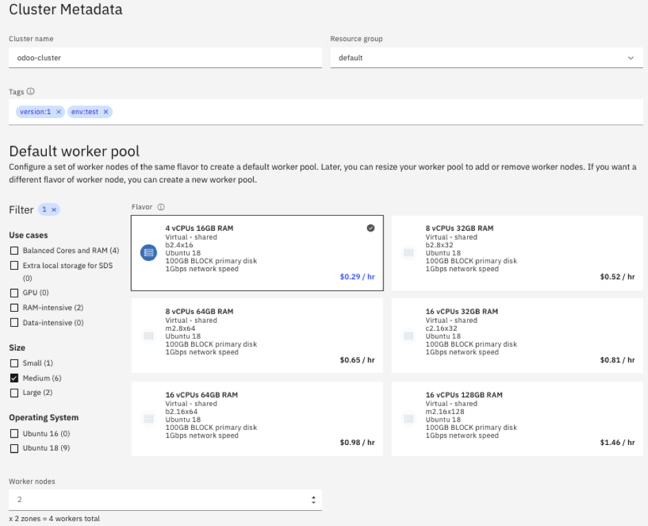

#### Step 02
You will be redirected to some instructions page which gives you some commands to run in order to be able to access the cluster using the command line if this was your first cluster.

curl -sL https://ibm.biz/idt-installer | bash

Download and install a few CLI tools and the Kubernetes Service plug-in.

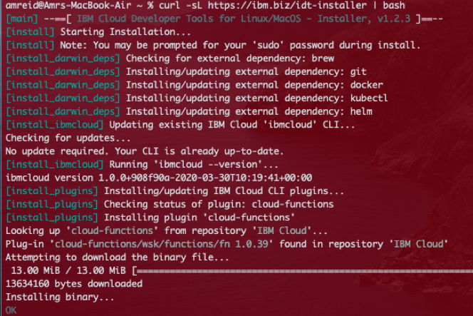

ibmcloud login -sso
Log in to your IBM Cloud account.

ibmcloud ks cluster config --cluster xxxxxx

Download the kubeconfig files for your cluster. You will need to replace xxxx with your cluster id.

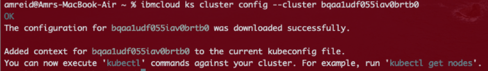

kubectl version --short

Verify that you can connect to your cluster.

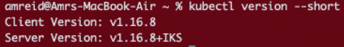

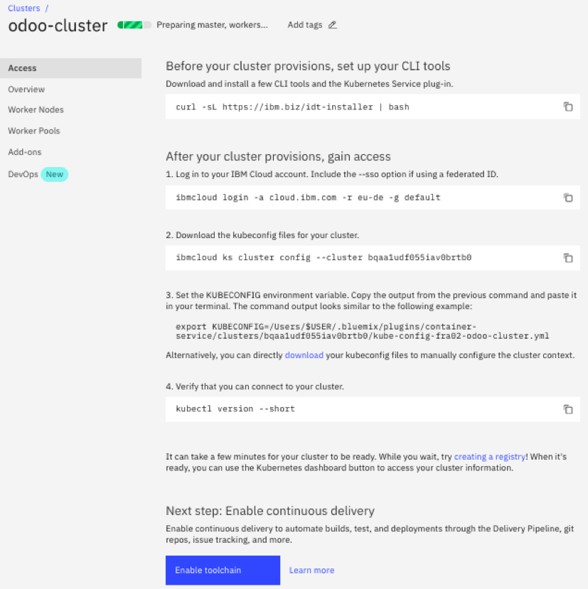

#### Step 03
Provisioning the cluster will take around 15 mins, In this time, we can setup up some packages in order to access the registry.
 In order to do that, you will need to install Docker first as well as the below packages.

ibmcloud plugin install container-registry -r 'IBM Cloud'
Download and install a few CLI tools and the Kubernetes Service plug-in.

ibmcloud cr region-set eu-de
Ensure that you're targeting the correct IBM Cloud Container Registry region.

ibmcloud cr namespace-add <my_namespace>
Choose a name for your first namespace

When the cluster turns green, with Normal status, Validate it is working properly by checking the Overview page. 

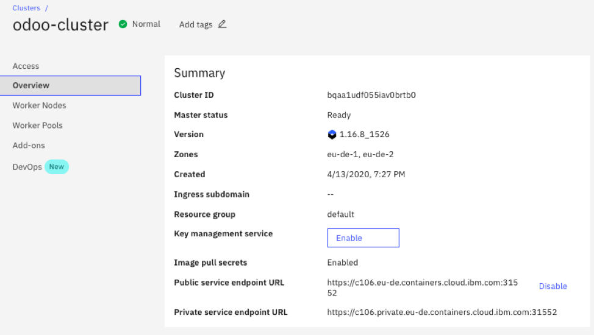

The easiest way to proceed with the cluster is to open the dashboard, Click on the Kubernetes Dashboard button to open the K8s Dashboard.

You can validate your Nodes, (you should find 4 nodes each two in different subnet)
You will find no deployment, as you didn’t deploy anything yet

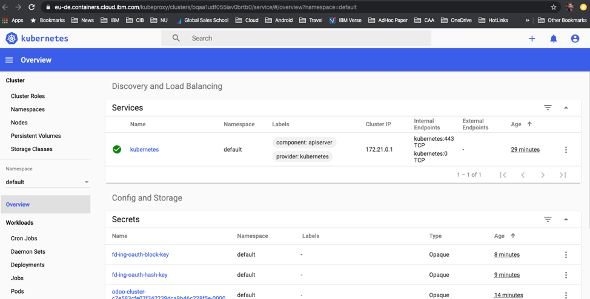

#### Step 04, Create Custom Namespace

kubectl create namespace eidns
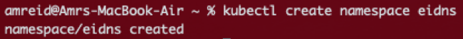

#### Step 05, 
From the registry view, Choose Helm Catalog, search for Odoo Helm Chart.

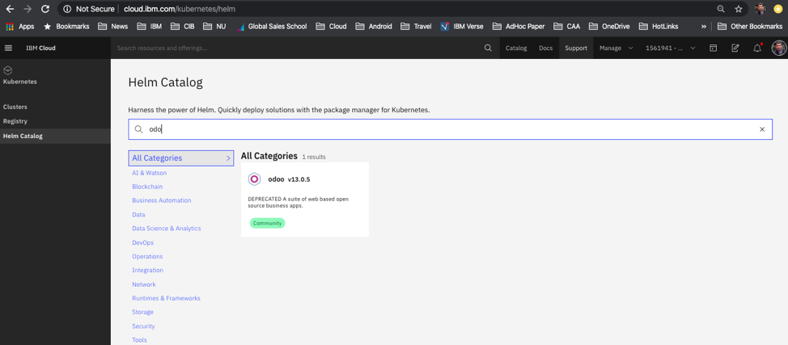

#### Step 06, 
If you haven’t already, add the repo.
helm repo add kubernetes https://kubernetes-charts.storage.googleapis.com

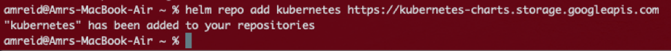

Choose a release name and install the chart. Specify parameters 
helm install --name <releasename> kubernetes/odoo --namespace=foo

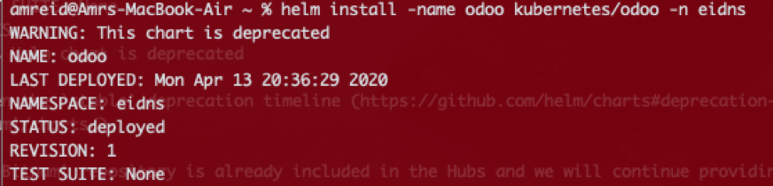

Validate that your helm chart has been installed.
helm list

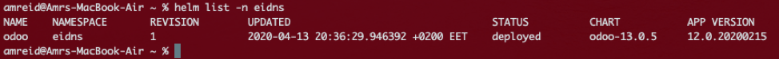

#### Step 07, 
Now it is the time to Open and test Odoo portal.
From the services view, you will find Odoo service up and running, and the external endpoint is there.

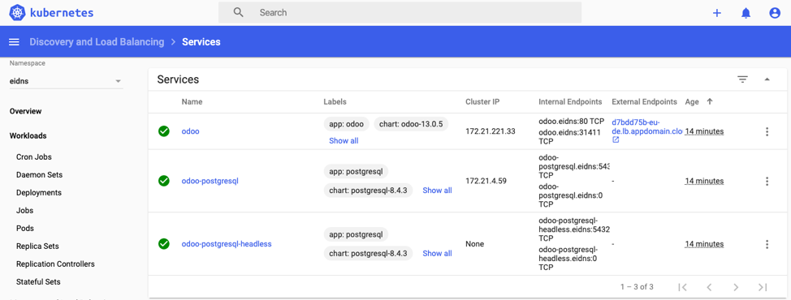

Step 07, Click on the external endpoint which will launch in your default browser.
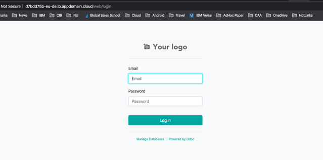

From Pods view, Containers section you can get the username and password to access Odoo portal.
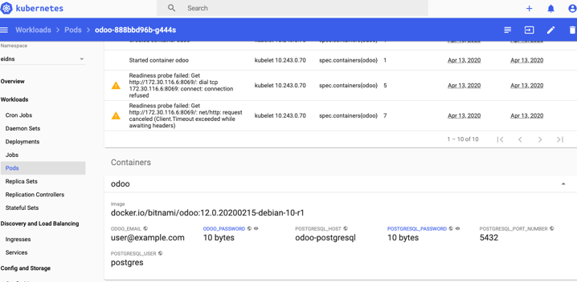

Finally, You get Odoo up and running. 
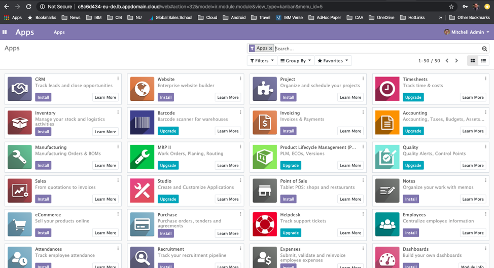

## Installing LogDNA

LogDNA is a third-party service that you can use to add intelligent logging capabilities to your cluster and apps.

#### Two Parts: 
We need to have LogDNA as a service
We need to install the agent on K8s Cluster.

#### LogDNA as a service
You need to pick DNA from IBM Cloud portal Catalog, and provision it. You can choose the price plan you like then hit Create. 
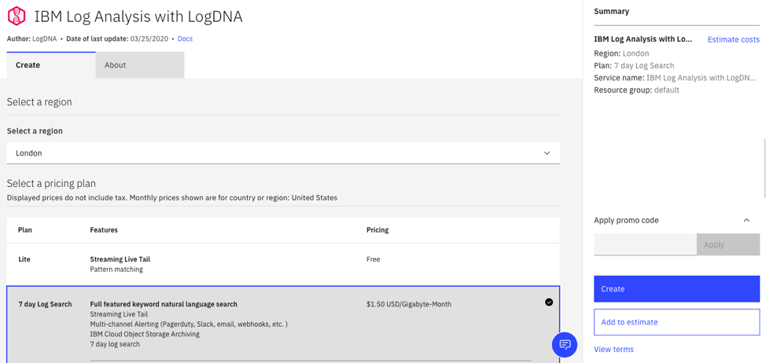

You will get it provisioned in no time, Logging Portal will be open to you where you can open LogDNA portal through the “View LogDNA” link. 
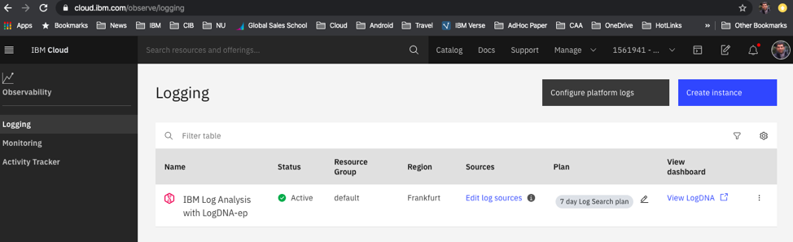

If you open logDNA portal before setting the Log Sources, you will have it empty like below
LogDNA portal should open like the below screenshot.
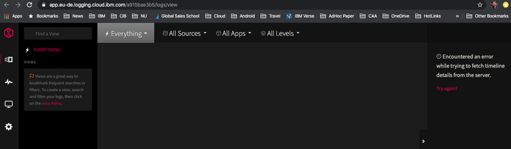

In order to configure the Log sources to read from the K8s cluster we created earlier,  from the Logging view, Hit Edit Log Sources, This is where you can configure the different Log sources 
The view is providing you with couple of kubectl create commands , Just execute them both , and attach the namespace if you are using a different namespace than the default. 
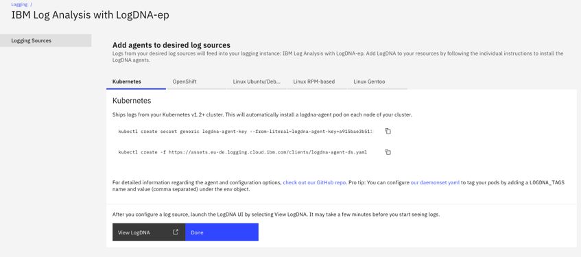

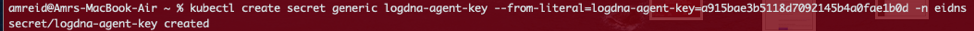
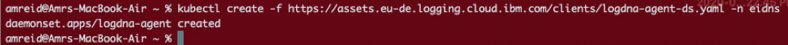

In order to validate it can read properly , you need now to check logDNA Dashboard, You should find it reading logs like below screenshot.

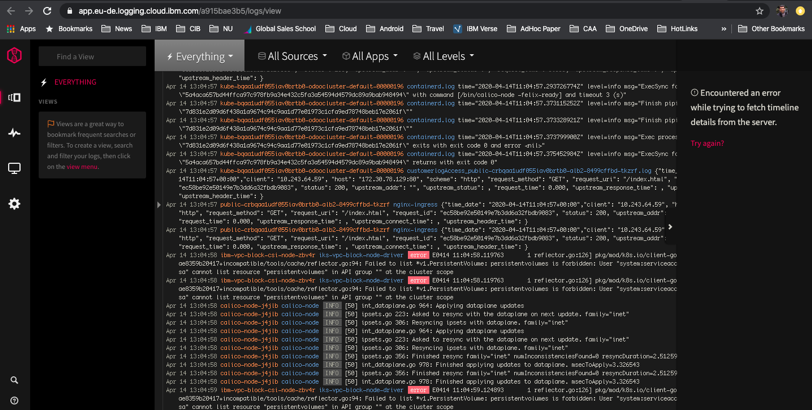

#### Note:
As an alternative way, you can do the same LogDNA agent installation on IKS using the Helm Catalog.
From this catalog, You  can start with choosing LogDNA

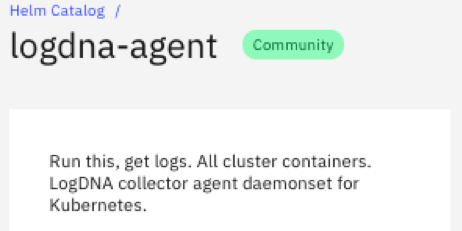

helm repo add kubernetes https://kubernetes-charts.storage.googleapis.com
If you haven’t already, add the repo.

helm install -name logdna kubernetes/logdna-agent -n eidns
Choose a release name and install the chart. 
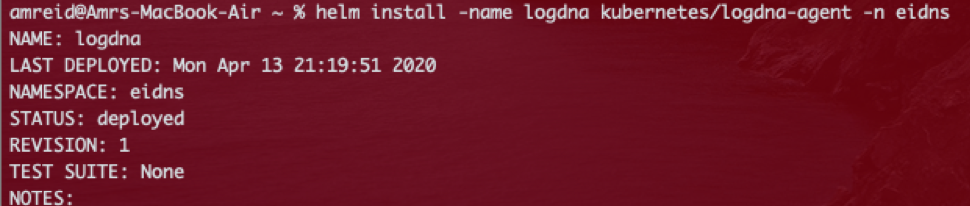

helm list -n eidns
Verify that you successfully installed the chart.
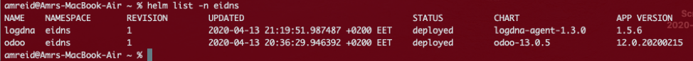

## Installing Sysdig
Sysdig is a third-party, cloud-native container analytics system that you can use to gain insight into the performance and health of your compute hosts, apps, containers, and networks.
Two Parts: 
We need to have Sysdig as a service (IBM Cloud Monitoring with Sysdig).
We need to install the agent on K8s Cluster.

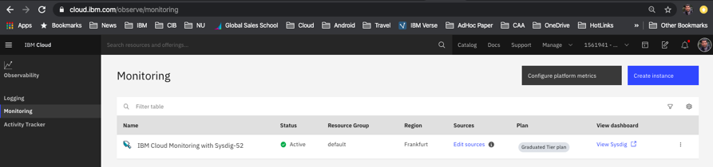

helm install --name sysdig kubernetes/sysdig -n eidns
Choose a release name and install the chart. 
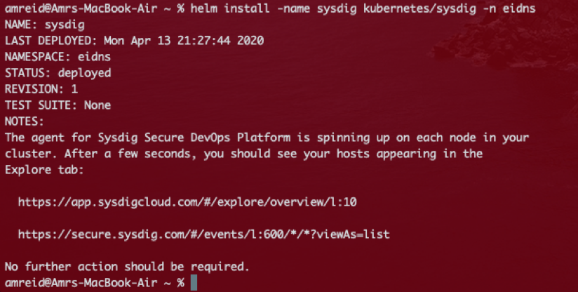

helm list -n eidns
Verify that you successfully installed the chart.

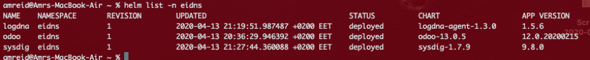

## Financial Flavor
IBM Customer will have to pay for his customized service based on what he will use, Based on the exercise we are proposing here, The customer will have to pay for the infrastructure he is using, which means IKS Infrastructure plus the PaaS he is using from IBM catalog which means Sysdig and LogDNA.

IKS Cluster is based on MultiZones (Only 2 Zones), with 2 Worker Nodes (4*16 VSI) per each zone.

       IKS + LogDNA + SysDig average list price = 1500$ MRR
             

